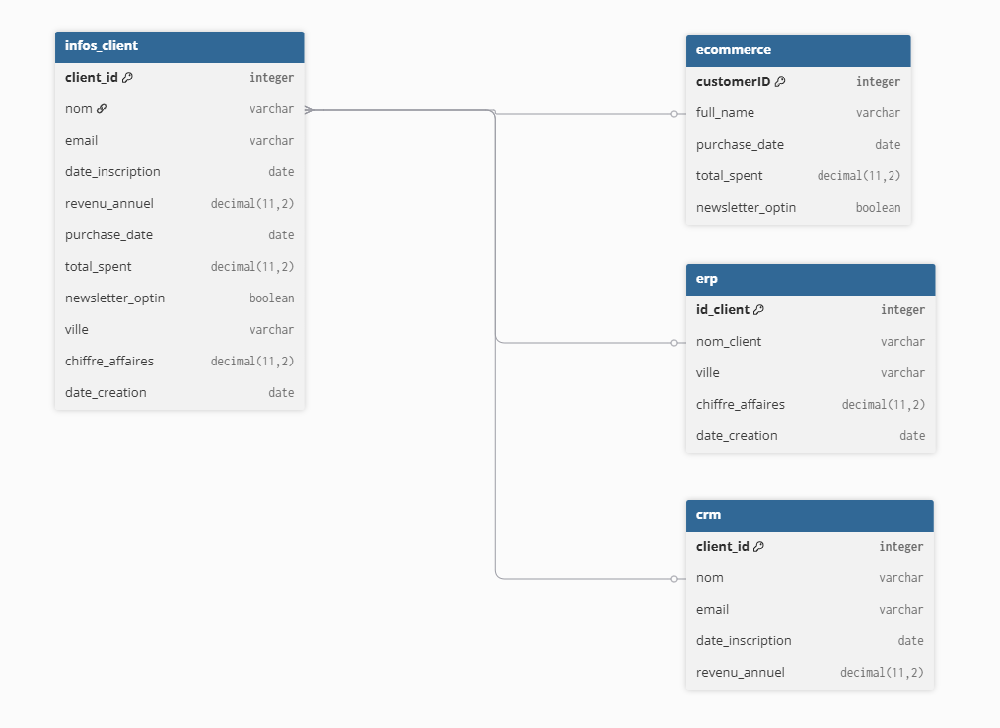
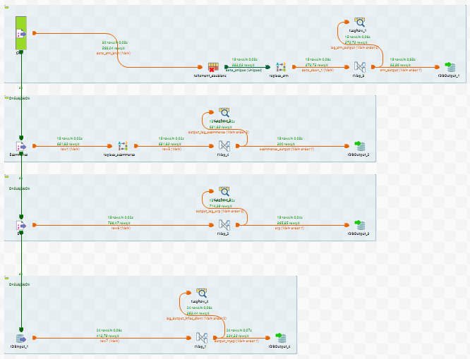
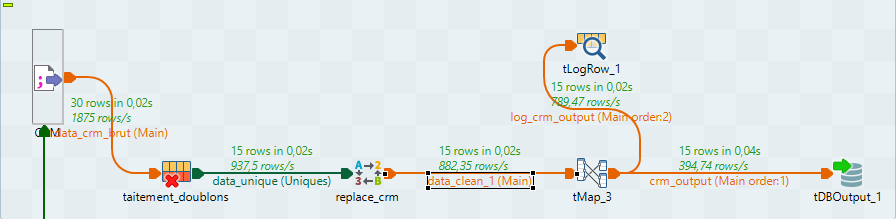
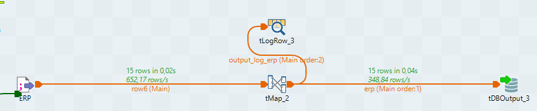
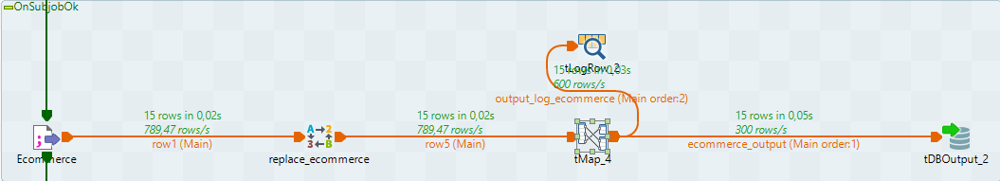
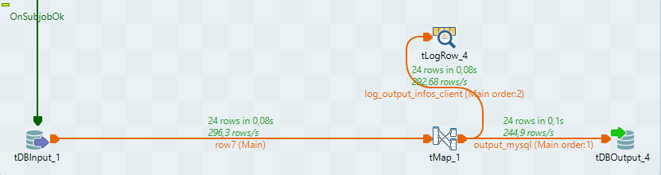
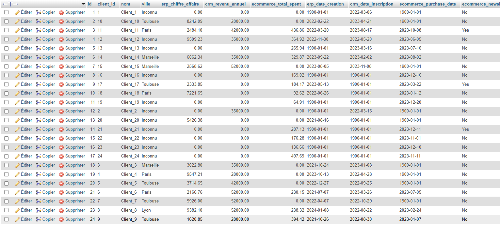

# Documentation technique - ETL Talend

Cette documentation technique à pour objectif de présenter le projet d'ETL réalisé sur Talend dans un aspect plus poussé, en détaillant le fonctionnement de chaque sous-job et les modules utilisés.
De manière générale, le projet ETL consiste à récupérer trois fichiers CSV ayant sensiblement les même informations, pas les même colonnes et beaucoup d'erreurs ou de valeurs nulles, de les nettoyer, les fusionner et les intégrer dans une base de données SQL

## Présentation du projet : 

Le projet contient trois fichiers CSV : 
- crm.csv : Listing des lignes issues du CRM 
- erp.csv : Listing des lignes issues de l'ERP
- ecommerce.csv : Listing des lignes issues du site Ecommerce

## Conception du diagramme



Le diagramme est comme suit dans l'image ; nous avons une table SQL par fichier CSV, elles sont reliées à la table finale par des relations 0.1:n et sont reliées entre elles par les noms des clients. Malheureusement, les différents outils ne sont pas reliés pour les noms clients, ce qui fausse les jointures.

## Fonctionnement de la pipeline



Vous trouverez ci-joint le schéma de la pipeline. Chaque sous-job va être intégralement détaillé sur son fonctionnement et pourquoi son choix.

### Sous-job 1 - Traitement CRM (crm.csv)

Le fichier crm.csv a plusieurs erreurs et objectifs à traiter :
- Revenu annuel avec caractères non pris en compte (€) 
- Espaces et valeurs vides
- Lignes en doublon
- Ajouter les données dans la table dédiée

#### Nous avons donc cette pipeline de données :



#### Dans le détail :
- Importation du fichier CSV avec fileInputDelimited (délimiteur virgule (,))
- Utilisation d'un tUniqRow pour dédupliquer les lignes du fichier CSV
- Envoi des données dans un tReplace pour remplacer les données sous deux cas de figure : Suppression des caractères faussés et premiers espaces (€ ; € ; " "). Attention, bien penser à décocher la case "tout le mot" pour faire fonctionner le remplacement
- Les données sont envoyées dans un tMap pour un dernier traitement, surtout la gestion des valeurs nulles et le changement de type des données
    - Avec un ParseDate on crée une date de base au 01/01/1900 si la date est Null
    - Avec un ParseInt et un Trim() on affiche un 0 si le revenu annuel est Null ou vide. Trim() permet de gérer le cas de figure où il y a plus d'un seul espace
- Un tLogRow est créé pour tracker la sortie du tMap et voir si les données sont correctement transformées
- Pour finir les données sont importées dans la base de données MySQL, et la table dédiée, nommée crm.

### Sous-job 2 - Traitement ERP (erp.csv)

Le fichier erp.csv a plusieurs erreurs et objectifs à traiter :
- Des villes ont des valeurs Nulles
- Les dates ne sont pas au bon format "yyyy-MM-dd"
- L'identifiant du client est différent de la logique appliquée par le CRM

#### Nous avons donc cette pipeline de données :



#### Dans le détail :

Pour ce fichier, je n'ai besoin que d'un tMap pour les transformations, pas besoin des autres modules de Talend

- Importation du fichier CSV avec fileInputDelimited (délimiteur virgule (,))
- Les données sont envoyées dans un tMap pour le traitement, on aurait le traitement des villes nulles, le format des dates et le changement de certains types de données.
    - Avec un ParseDate on crée une date de base au format "yyyy-MM-dd" si la date_creation est Null
    - Avec un ParseDouble et un Trim() on affiche un 0 si le chiffre d'affaire est Null ou vide. Trim() permet de gérer le cas de figure où il y a plus d'un seul espace, sinon on crée le chiffre d'affaire au format Double
    - Si la ville est Null ou vide (avec Trim() là encore), on affiche "Inconnu", je ne souhaitais pas afficher une valeur par défaut pour éviter de fausser les résultats futurs
- Un tLogRow est créé pour tracker la sortie du tMap et voir si les données sont correctement transformées
- Pour finir les données sont importées dans la base de données MySQL, et la table dédiée, nommée erp.
- Concernant l'identifiant client, on le laisse de côté pour l'instant, il sera traité dans le sous-job final

### Sous-job 3 - Traitement Ecommerce (ecommerce.csv)

Le fichier ecommerce.csv a le plus d'erreurs et objectifs à traiter :
- Les dates sont au format “dd-MM-yyyy”
- La logique de l'identifiant client est différent de celle du CRM
- La colonne total_spend a des valeur faussées (€, €, " ")
- La colonne Newsletter_optin est parfois vide

#### Nous avons donc cette pipeline de données :



#### Dans le détail :

- Importation du fichier CSV avec fileInputDelimited (délimiteur virgule (,))
- Les données sont envoyées dans un tReplace pour traiter les valeurs faussées, et les remplacer par une valeur vide ""
- Elles sont ensuites envoyées vers un tMap pour la majorité de la transformation
    - Avec un ParseDouble et un Trim() on affiche un 0 si le chiffre d'affaire est Null ou vide. Trim() permet de gérer le cas de figure où il y a plus d'un seul espace, sinon on crée le chiffre d'affaire au format Double
    - Avec un ParseDate on crée une date de base au format "yyyy-MM-dd" si la date_creation est Null
    - Si le Newsletter_optin est à Null, la valeur par défaut est à "No", cette modification suit les règles de base et la loi en ce qui concerne les incriptions aux newsletters
- Un tLogRow est créé pour tracker la sortie du tMap et voir si les données sont correctement transformées
- Pour finir les données sont importées dans la base de données MySQL, et la table dédiée, nommée ecommerce.
- Concernant l'identifiant client, on le laisse de côté pour l'instant, il sera traité dans le sous-job final

### Sous-job 4 - Traitement final



Pour finir, le traitement final va récupérer le contenu des trois premières tables via un FULL OUTER JOIN pour combiner les tables entre elles. MySQL n'acceptant pas le FULL OUTER JOIN, il a fallu faire une requête mixée avec différent LEFT JOIN et des UNION :

```
SELECT 
    COALESCE(c.client_id, a.id_client, b.customerID) AS client_id,
    COALESCE(c.nom, a.nom_client, b.full_name) AS nom,
    COALESCE(a.ville, 'Inconnu') AS ville,
    COALESCE(a.chiffre_affaire, 0.00) AS erp_chiffre_affaire,
    COALESCE(c.revenu_annuel, 0) AS crm_revenu_annuel,
    COALESCE(b.total_spent, 0.00) AS ecommerce_total_spent,
    COALESCE(a.date_creation, '1900-01-01') AS erp_date_creation,
    COALESCE(c.date_inscription, '1900-01-01') AS crm_date_inscription,
    COALESCE(b.purchase_date, '1900-01-01') AS ecommerce_purchase_date,
    COALESCE(b.newsletter_optin, 'No') AS ecommerce_newsletter_optin,
    c.email AS email
FROM erp a
LEFT JOIN ecommerce b ON a.nom_client = b.full_name
LEFT JOIN crm c ON a.nom_client = c.nom

UNION

SELECT 
    COALESCE(c.client_id, a.id_client, b.customerID) AS client_id,
    COALESCE(c.nom, a.nom_client, b.full_name) AS nom,
    COALESCE(a.ville, 'Inconnu') AS ville,
    COALESCE(a.chiffre_affaire, 0.00) AS erp_chiffre_affaire,
    COALESCE(c.revenu_annuel, 0) AS crm_revenu_annuel,
    COALESCE(b.total_spent, 0.00) AS ecommerce_total_spent,
    COALESCE(a.date_creation, '1900-01-01') AS erp_date_creation,
    COALESCE(c.date_inscription, '1900-01-01') AS crm_date_inscription,
    COALESCE(b.purchase_date, '1900-01-01') AS ecommerce_purchase_date,
    COALESCE(b.newsletter_optin, 'No') AS ecommerce_newsletter_optin,
    c.email AS email
FROM ecommerce b
LEFT JOIN erp a ON a.nom_client = b.full_name
LEFT JOIN crm c ON c.nom = b.full_name

UNION

SELECT 
    COALESCE(c.client_id, a.id_client, b.customerID) AS client_id,
    COALESCE(c.nom, a.nom_client, b.full_name) AS nom,
    COALESCE(a.ville, 'Inconnu') AS ville,
    COALESCE(a.chiffre_affaire, 0.00) AS erp_chiffre_affaire,
    COALESCE(c.revenu_annuel, 0) AS crm_revenu_annuel,
    COALESCE(b.total_spent, 0.00) AS ecommerce_total_spent,
    COALESCE(a.date_creation, '1900-01-01') AS erp_date_creation,
    COALESCE(c.date_inscription, '1900-01-01') AS crm_date_inscription,
    COALESCE(b.purchase_date, '1900-01-01') AS ecommerce_purchase_date,
    COALESCE(b.newsletter_optin, 'No') AS ecommerce_newsletter_optin,
    c.email AS email
FROM crm c
LEFT JOIN erp a ON a.nom_client = c.nom
LEFT JOIN ecommerce b ON b.full_name = c.nom  
ORDER BY `nom` ASC;
```

**Grâce à la fonction COALESCE, on peut faire un peu de nettoyage et dire que "si la donnée est vide, alors je met telle valeur"**

Suite à cette requête, les valeurs sont envoyées dans un tMap pour faire différents traitements :
- On commence par la logique de l'identifiant client. Pour ça, on va utiliser le nombre présent dans le nom client (Client_1, Client_5...) pour faire l'Id. Pour ça on utilise une logique liée au Java pour vérifier si l'Id est bon ou pas
- On suit la même logique pour l'email, on voit que les patterns des emails sont les même "Client" + Id_client + "@gmail.com"
- On modifie également les dates pour les mettre au bon format via un parseDate

Les données sont ensuite envoyées directement dans la nouvelle base de données et la table finale infos_client.




## (Perso) Points d'amélioration
- La requête SQL peut être amélioré, je crois qu'elle n'affiche qu'un client, et par exemple le fichier ecommerce traite chaque transactions. Un client peut faire plusieurs transactions mais la requête casse ce concept, à revoir
- Parraléliser les trois premiers jobs pour gagner du temps et choisir en amont les lignes à traiter
- La pipeline travaille en 6 secondes actuellement, il doit être possible de travailler en 2/3 secondes avec ces améliorations
- Ajouter des logs pour traiter les erreurs

- Réfléchir à un autre axe où on place les infos vides dans un autre fichier
